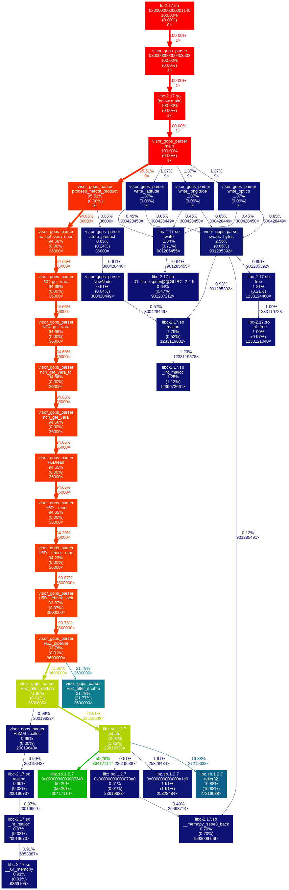

# Test Case & Metrics

## Processing Times

### ***NRL Developer Hardware Configuration***

|Component      | Specification                                           |
|---------------|---------------------------------------------------------|
|Processor      | 40 CPU, Intel Xeon Silver 4114 CPU @ 2.2GHZ             |
|Memory         | 251 GB                                                  |

### ***NRL Server Hardware Configuration***

|Component      | Specification                                           |
|---------------|---------------------------------------------------------|
|Processor      | 40 CPU, Intel Xeon Silver 4114 CPU @ 2.2GHZ             |
|Memory         | 251 GB                                                  |

### ***DSRC Hardware Configuration***

|Component      | Specification                                           |
|---------------|---------------------------------------------------------|
|Asset          | Gordon, Conrad, Koehr, Gaffney                          |
|Queue          | Standard, HIE, gpu                                      |

### ***Times***

|Platform                | Total time (minutes)  |
|------------------------|-----------------------|
|NRL Developer           | 23.02                 |
|NRL Server (single)     |  4.00+                |
|NRL Server (all, batch) |  6.00+                |
|NRL Server              | 33.92                 |
|Conrad                  | 27.89                 |
|Gaffney                 | 27.32                 |
|Koehr                   | 26.25                 |
|Gordon                  | 28.48                 |

## GOPS daily cron copy of files 

[Example Results for Reference](./gops_copy_script.md)

## SonarQube Analysis from DI2E Resources

[SonarQube Results](https://sonarqube.di2e.net/dashboard?id=visor_gops_parser)
[SonarQube Results v1.1.13](./visor_gops_parser_sonarqube.png)

## Call Graph

[visor_gops_parser Call Graph](./visor_gops_parser_callgraph.png)

## Test Case Results

Region: World (global) on 2020/01/01

### Parameters

+ a_490_lmi (lat, lon)

### Satellite Data

+ Input: /projects/socom/NCODA_TESTCASE/merged.2020010.0110.L5.10D.a_490_lmi.nc
+ 18000 x 36000 matrix
+ Products: a_490_lmi

### Initial Results

+ Successful execution.
+ 1819s (~30 mins) runtime.
+ All outputs created and of sizes expected.
+ Program started and finished according to logs.
+ Each slice records read-in, records output, and inspection of binary output with 010 indicated proper output.
+ Scale factor and offset read in by program verified by SeaDAS and `ncdump -h`.
+ Percentage coverage consistent between multiple execution runs on same input file.
+ 5,000+ DSRC executions on: gaffney, koehr, gordon, and conrad

|Statistic           | Gaffney    | Koehr     | Gordon    | Conrad   |
|--------------------|------------|-----------|-----------|----------|
|Avg Exe Time (s)    | 1,638.92   | 1,574.80  | 1,708.95  | 1,673.40 |
|Avg Exe Time (m)    |    27.32   |    26.25  |    28.48  |    27.89 |
|Avg Memory Use (GB) |     4.38   |     4.92  |      unk  |      unk |
|Predominant Queue   |      GPU   |      HIE  | standard  | standard |

### FY21 v.1.1.20 Results

+ Successful execution.
+ Processing time for all slices sequentially took 1643s, aproximately 27 minutes.
+ Processing time for a single slice took 214s, aproximately 4 minutes.
+ Processing time for all slices using multiple batch jobs took, 228s, aproximately 4 minutes with longest time at 6 minutes for all slices.
+ All outputs created and of sizes expected.
+ Program started and finished according to logs.
+ Percentage coverage consistent between multiple execution runs on same input file.

Added functionality to select the number of times to split the GOPS input file and which (if any index to select):

|Index (of split)      | Split            | Results                                            |
|----------------------|------------------|----------------------------------------------------|
| Tested an index of -1| using split of 9.| Failed, expected and error message provided.       |
| Tested an index of  0| using split of 9.| Passed, output as expected.                        |
| Tested an index of  1| using split of 9.| Passed, output as expected.                        |
| Tested an index of  2| using split of 9.| Passed, output as expected.                        |
| Tested an index of  3| using split of 9.| Passed, output as expected.                        |
| Tested an index of  8| using split of 9.| Passed, output as expected.                        |
| Tested an index of  9| using split of 9.| Failed, expected and error message provided.       |
| Tested an index of 19| using split of 9.| Failed, expected and error message provided.       |
| Tested an index of -1| no inputs given. | Failed, expected with split defaulting to 9 and message about index being in error. |
| Tested an index of  0| no inputs given. | Passed, output as expected.                        |
| Tested an index of  1| no inputs given. | Passed, output as expected.                        |
| Tested an index of -1| using split of  8| Failed, expected and error indicated minimal ranges.|
| Tested an index of  0| using split of  8| Failed, expected and error indicated minimal ranges.|
| Tested an index of  1| using split of  8| Failed, expected and error indicated minimal ranges.|
| Tested an index of -1| using split of 20| Failed, expected and error indicated minimal ranges.|
| Tested an index of  0| using split of 20| Failed, expected and error indicated minimal ranges.|
| Tested an index of  1| using split of 20| Failed, expected and error indicated minimal ranges.|

Output from Slice 0 was compared to the default number of slices, all slices at once (sequential), and the multi-cpu solution with the following results:

| filename                             | Checksum                        |
|--------------------------------------|---------------------------------|
| md5sum ./202106050000_a_490_lmi_0.out|6e9a60641c49fd402f824983e3615343 |
| md5sum ./20210729_restuls/all_0.out  |6e9a60641c49fd402f824983e3615343 |
| md5sum ./20210729_restuls/Nine_202106050000_a_490_lmi_0.out|6e9a60641c49fd402f824983e3615343|

Output from logs where metrics are gathered such as number of good versus bad records, percent coverage and related output are completely consistent across all log outputs.

Thus proving consistent results across multiple invocations.

### Compilation Results

#### BioCast (post build)

+ [make.log](./make.log)
+ [error_messages](./error_messages)
+ [diagnostics_messages](./diagnostic_messages)
